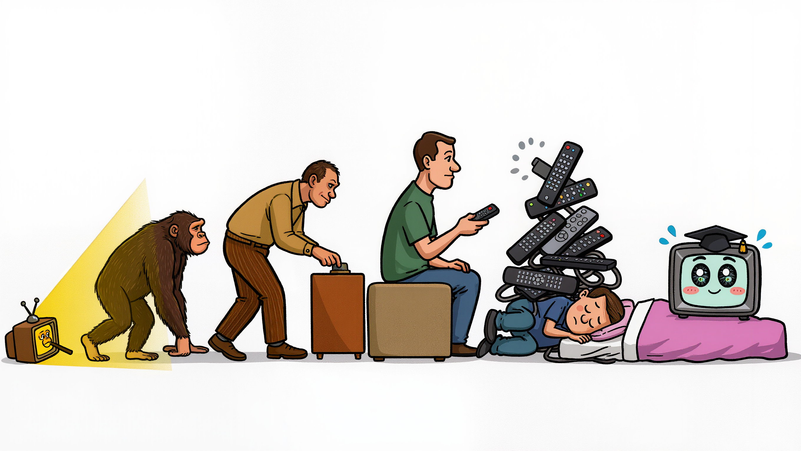

# smartest-tv

[](https://pypi.org/project/stv/)
[](LICENSE)
[](https://python.org)

[English](../../README.md) | [한국어](README.ko.md) | [中文](README.zh.md) | [日本語](README.ja.md) | **Español** | [Deutsch](README.de.md) | [Português](README.pt-br.md) | [Français](README.fr.md)

**Habla con tu tele. Te escucha.**

Otras herramientas abren Netflix. smartest-tv pone *la temporada 2 episodio 8 de Frieren*.

<p align="center">
  
</p>

## Inicio rápido

```bash
pip install stv
stv setup          # detecta tu tele automáticamente, empareja, listo
```

Eso es todo. Sin modo desarrollador. Sin API keys. Sin variables de entorno. Di lo que quieres ver.

## ¿Qué puedes hacer?

```
Tú: Pon la temporada 2 episodio 8 de Frieren en Netflix
Tú: Pon Baby Shark para los chicos
Tú: El nuevo álbum de Ye en Spotify
Tú: Apaga la pantalla y pon mi playlist de jazz
Tú: Buenas noches
```

La IA encuentra el ID del contenido (episodio de Netflix, video de YouTube, URI de Spotify), llama a `stv`, y tu tele lo pone.

### See it in action

https://github.com/Hybirdss/smartest-tv/raw/main/docs/assets/demo.mp4

## Instalación

```bash
pip install stv                 # LG (por defecto, todo incluido)
pip install "stv[samsung]"      # Samsung Tizen
pip install "stv[android]"      # Android TV / Fire TV
pip install "stv[all]"          # Todo
```

## CLI

```bash
stv play netflix "Frieren" s2e8 --title-id 81726714   # Buscar + reproducir en un paso
stv play youtube "baby shark"                          # Buscar + reproducir
stv resolve netflix "Jujutsu Kaisen" s3e10 --title-id 81278456  # Solo obtener el ID
stv launch netflix 82656797         # Deep link directo (si ya conoces el ID)
stv status                          # Qué está sonando, volumen, silencio
stv volume 25                       # Ajustar volumen
stv mute                            # Activar/desactivar silencio
stv apps --format json              # Lista de apps (salida estructurada)
stv notify "La cena está lista"     # Notificación en pantalla
stv off                             # Buenas noches
```

Todos los comandos admiten `--format json` — diseñado para scripts y agentes de IA.

### Resolución de contenido

`stv resolve` encuentra los IDs de streaming para que no tengas que hacerlo tú. `stv play` hace lo mismo y además lanza el contenido en la tele en un solo paso.

```bash
stv resolve netflix "Frieren" s2e8 --title-id 81726714    # → 82656797
stv resolve youtube "lofi hip hop"                         # → dQw4w9WgXcQ (via yt-dlp)
stv resolve spotify spotify:album:5poA9SAx0Xiz1cd17fWBLS  # → se pasa tal cual
```

La resolución de Netflix funciona extrayendo los metadatos del episodio de la página del título con una sola petición `curl` — sin Playwright, sin navegador, sin login. Todas las temporadas se resuelven de una vez y se cachean localmente. La segunda consulta es instantánea (~0,1 s).

### Caché

Una vez encontrado un ID, queda cacheado para siempre en `~/.config/smartest-tv/cache.json`. También puedes rellenar el caché manualmente:

```bash
stv cache set netflix "Frieren" -s 2 --first-ep-id 82656790 --count 10
stv cache get netflix "Frieren" -s 2 -e 8    # → 82656797
stv cache show                                # Mostrar todos los IDs cacheados
```

## Skills para agentes

smartest-tv incluye cinco skills que enseñan a los asistentes de IA a controlar tu tele. Instálalos en Claude Code:

```bash
cd smartest-tv && ./install-skills.sh
```

| Skill | Qué hace |
|-------|----------|
| `tv-shared` | Referencia CLI, autenticación, configuración, patrones comunes |
| `tv-netflix` | Búsqueda de IDs de episodios mediante scraping HTTP |
| `tv-youtube` | Búsqueda de videos con yt-dlp, resolución de formato |
| `tv-spotify` | Resolución de URIs de álbumes, canciones y playlists |
| `tv-workflow` | Acciones combinadas: noche de cine, modo niños, temporizador |

Los skills son archivos Markdown simples. Puedes portarlos a cualquier agente en minutos.

## Funciona con

Cualquier agente de IA que pueda ejecutar comandos de shell:

**Claude Code** · **OpenCode** · **Cursor** · **Codex** · **OpenClaw** · **Goose** · **Gemini CLI** · o simplemente `bash`

## En el mundo real

**Son las 2 de la mañana.** Estás en la cama y le dices a Claude: "Sigue Frieren donde lo dejé." El televisor del salón se enciende, Netflix se abre, el episodio empieza. Nunca tocaste el control. Apenas abriste los ojos.

**Sábado en la mañana.** "Pon Cocomelon para el bebé." YouTube lo encuentra, la tele lo pone. Tú sigues haciendo el desayuno.

**Llegaron los amigos.** "Modo juego, HDMI 2, baja el volumen." Una frase, tres cambios, antes de que alguien lo note.

**Cocinando.** "Apaga la pantalla y pon mi playlist de jazz." La pantalla se apaga, la música fluye por los parlantes.

**Cayéndote de sueño.** "Temporizador de 45 minutos." La tele se apaga sola. Tú, no.

## Qué es smartest-tv

- **Resolvedor de deep links** — encuentra el ID del episodio en Netflix, el video en YouTube, la URI en Spotify
- **Control universal** — un solo CLI para 4 plataformas de TV
- **Hecho para agentes** — diseñado para que lo llamen los agentes, no solo los humanos

## Qué no es

- No es una app de control remoto (sin zapping de canales, sin teclas de dirección)
- No es un controlador HDMI-CEC
- No es una herramienta de screen mirroring

<details>
<summary><strong>Deep Linking</strong> — cómo funciona por dentro</summary>

El mismo ID de contenido funciona en todas las plataformas de TV:

```bash
stv launch netflix 82656797                           # LG, Samsung, Roku, Android TV
stv launch youtube dQw4w9WgXcQ                        # Igual
stv launch spotify spotify:album:5poA9SAx0Xiz1cd17f   # Igual
```

Cada driver traduce el ID al formato de deep link nativo de la plataforma:

| TV | Cómo envía el deep link |
|----|------------------------|
| LG webOS | SSAP WebSocket: contentId (Netflix DIAL) / params.contentTarget (YouTube) |
| Samsung | WebSocket: `run_app(id, "DEEP_LINK", meta_tag)` |
| Android / Fire TV | ADB: `am start -d 'netflix://title/{id}'` |
| Roku | HTTP: `POST /launch/{ch}?contentId={id}` |

Nunca tienes que pensar en esto. El driver se encarga.

</details>

<details>
<summary><strong>Plataformas</strong> — TVs y drivers compatibles</summary>

| Plataforma | Driver | Conexión | Estado |
|------------|--------|---------|--------|
| LG webOS | [bscpylgtv](https://github.com/chros73/bscpylgtv) | WebSocket :3001 | **Probado** |
| Samsung Tizen | [samsungtvws](https://github.com/xchwarze/samsung-tv-ws-api) | WebSocket :8002 | Pruebas de la comunidad |
| Android / Fire TV | [adb-shell](https://github.com/JeffLIrion/adb-shell) | ADB TCP :5555 | Pruebas de la comunidad |
| Roku | HTTP ECP | REST :8060 | Pruebas de la comunidad |

LG es la plataforma principal probada. Ninguna requiere modo desarrollador.

</details>

## Configuración sin complicaciones

```bash
stv setup
```

Detecta tu tele en la red, identifica la plataforma, empareja solo, y guarda todo en `~/.config/smartest-tv/config.toml`. Si algo no cuadra, `stv doctor` te dice exactamente qué está pasando.

```toml
[tv]
platform = "lg"
ip = "192.168.1.100"
mac = "AA:BB:CC:DD:EE:FF"   # optional, for Wake-on-LAN
```

En la primera conexión la tele muestra un aviso de emparejamiento. Lo aceptas una vez y la clave se guarda para siempre.

## Servidor MCP

Para Claude Desktop, Cursor u otros clientes MCP — esto es opcional, el CLI es la interfaz principal:

```json
{
  "mcpServers": {
    "tv": {
      "command": "uvx",
      "args": ["stv"]
    }
  }
}
```

## Arquitectura

```
Tú (lenguaje natural)
  → IA + stv resolve (busca el ID del contenido via scraping HTTP / yt-dlp / caché)
    → stv play (formatea el deep link y lo envía)
      → Driver (WebSocket / ADB / HTTP)
        → TV
```

<p align="center">
  
</p>

## Contribuir

| Estado | Área | Qué se necesita |
|--------|------|-----------------|
| **Listo** | Driver LG webOS | Probado y funcionando |
| **Necesita pruebas** | Drivers Samsung, Android TV, Roku | Se agradecen reportes con hardware real |
| **Se busca** | Skill de Disney+ | Resolución de IDs de deep link |
| **Se busca** | Skills de Hulu y Prime Video | Resolución de IDs de deep link |

La [interfaz del driver](src/smartest_tv/drivers/base.py) ya está definida — implementa `TVDriver` para tu plataforma y abre una PR.

## Licencia

MIT
